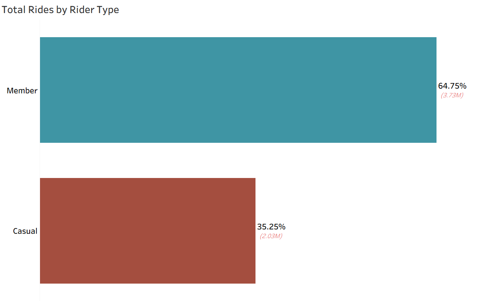
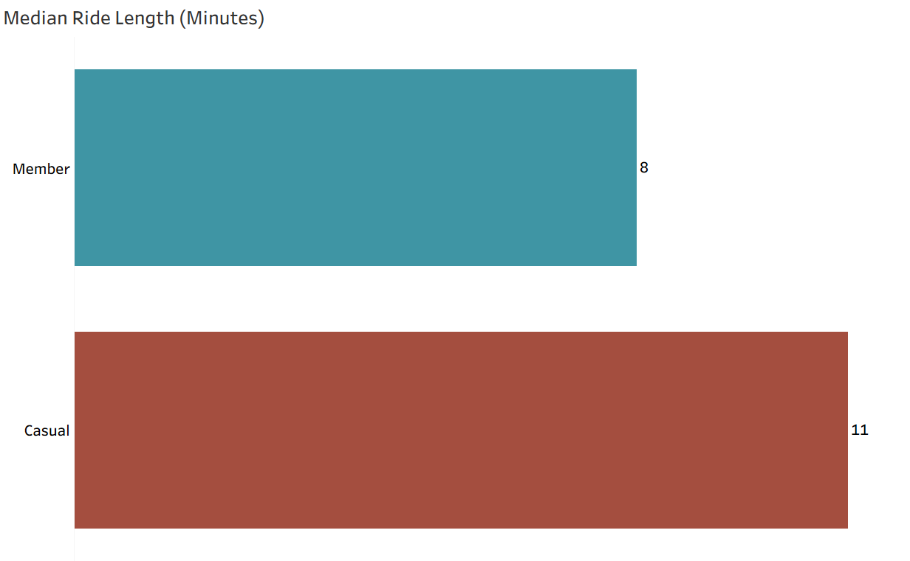
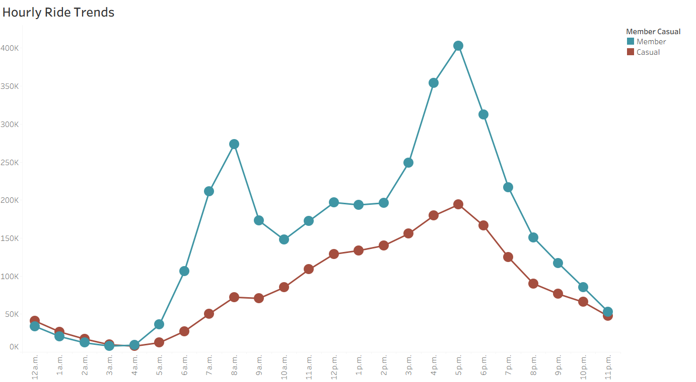
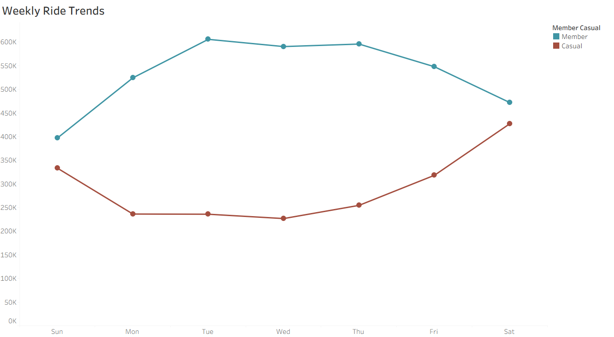
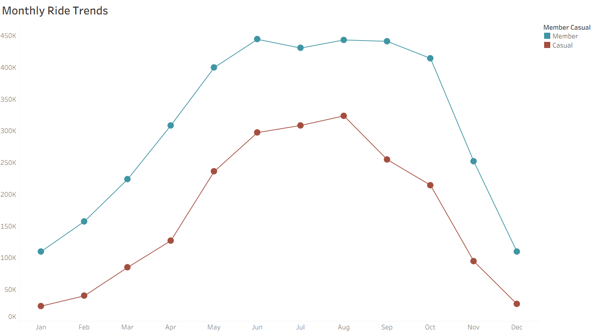
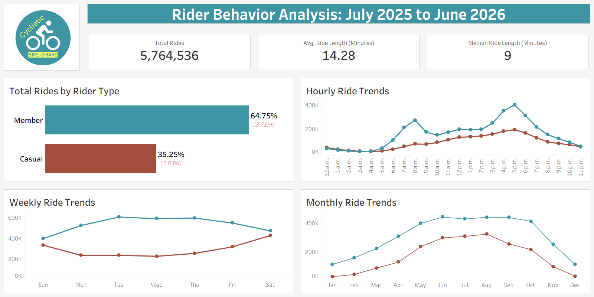

# Cyclistic-Bike-Share-Analysis

---

## Project Overview

Cyclistic is a fictional bike-share company operating in Chicago. They offer flexible single-ride passes and full-day passes for casual riders and annual memberships for Cyclistic members.

The goal of this analysis is to identify the differences between casual riders and annual members and develop new strategies for converting casual riders into members.

The subset of data contains trips from July 2025 to June 2026, representing one full year of rider activity.

---

## Business Task

Key Question:
“How do casual riders and annual members use Cyclistic differently, and what is the best way to  convert casuals into members?”
While the flexibility of casual rider passes helps to attract new customers, the key to Cyclistic’s growth and profitability is conversion to annual membership.
By understanding the differences between casuals and members new opportunities and strategies can be found.

---

## Data Sources

The data set used in this analysis is supplied by real-world company Divvy Bikes. The data is publicly available through Motivate International Inc. under a license for non-commercial purposes.

- [Data Set](https://divvy-tripdata.s3.amazonaws.com/index.html)
- [License](https://divvybikes.com/data-license-agreement)

---

## Tools Used

- Google Cloud Storage
- BigQuery
- SQL
- Tableau
- Google Slides

---

## Data Cleaning

Due to the large size of the dataset, the CSV files were stored in a Google Cloud Storage bucket and imported into BigQuery as a single table for SQL processing and analysis.

### Schema for Before cleaning

| Field Name | Type | Description
| -------- | -------- | -------- |
| ride_id  | string  | Unique ID for each ride. |
| rideable_type  | string  | Either classic or electric bikes. |
| started_at  | timestamp  | Start date and time for ride. |
| ended_at  | timestamp  | End date and time for ride |
| start_station_name  | string  | Name of starting station if applicable. |
| start_station_id  | string  | Unique ID for starting station. |
| end_station_name  | string  | Name of ending station if applicable. |
| end_station_id  | string  | Unique ID for ending station. |
| start_lat  | float  | Starting latitude of ride. |
| start_long  | float  | Starting longitude of ride. |
| end_lat  | float  | Ending latitude of ride. |
| end_long  | float  | Ending longitude of ride. |
| member_casual  | string  | Membership status of rider. |

First I created a new table to represent a cleaned version of the original trips table in order to keep the original intact for any needed reference later. For the new table I chose to not include the fields representing location data as the nature of the bike-share service allows users to start and end rides in any location. New fields were added to calculate the duration of each trip in minutes and extract the weekday and month from each trip’s start time. Finally, the table only includes records where the start time of trips preceded the end as some records had erroneous travel times suggesting negative trip durations.

### Cleaned Table Creation

```sql
CREATE TABLE `project-c54f5612-701d-49e0-878.cyclistic.trips_cleaned` AS

SELECT
  ride_id,
  rideable_type,
  started_at,
  ended_at,
  member_casual,

  TIMESTAMP_DIFF(ended_at, started_at, minute) AS ride_length,

  EXTRACT(DAYOFWEEK FROM started_at) AS day_of_week,

  EXTRACT(MONTH FROM started_at) AS month_of_year

FROM `project-c54f5612-701d-49e0-878.cyclistic.trips`

WHERE ended_at > started_at
```

Next, I checked for any duplicate record entries by counting trip IDs with multiple occurrences, resulting in 70 duplicates which were merged down to 35. 

### Query for Finding Duplicates

```sql
SELECT *
FROM (
    SELECT *, 
           COUNT(*) OVER(PARTITION BY ride_id) as total_occurrences
    FROM `project-c54f5612-701d-49e0-878.cyclistic.trips_cleaned`
) subquery
WHERE total_occurrences > 1
ORDER BY ride_id
```

I opted to merge matching records together by their ID in order to include any data that may be missing in one or both records. The merged records were then saved in a temporary table, then inserted back into the cleaned table after their originals were removed.

For my last cleaning step, I removed potential errors for trip durations. I opted to remove any trips that lasted fewer than ne minute and those longer than twenty-four hours as these appeared unlikely to be true records. Extremely short trips may reflect riders changing their minds while extremely long rides may be the result of bike theft, both are outside the scope of this analysis.

---

## Analysis

I Used SQL within BigQuery for my analysis, saving any important queries as new tables as I went along. For visualizations, I used Tableau connected to my BigQuery database.

1. The majority of rides were conducted by annual members accounting for 64.75% of total rides. This is likely indicative of members riding more frequently than their casual counterparts.



2. Casual riders tend to have longer rides with an average of 18.79 minutes and a median of 11 minutes respectively. Members have an average of 11.82 and median of 8 minutes.



3. Hourly trends show member rides prominently between 6 and 9 a.m. and 3 and 6 p.m. suggesting that they are using bikes for commuting to work. Casual riders show similar trends with an increase at the start of the work day gradually increasing until the end of the work day.



4. Weekly trends show an interesting inversion of trends between members and casuals. Member usage is predominantly weekdays while used the least during weekends. Casuals however, are mainly weekend riders with a lower amount of trips during the weekday.



5. Monthly trends show that the majority of rides for both types of riders take place during the warmer summer months. Colder months see rides drop off significantly with the remaining majority of riders being annual members.



---

## Limitations

- Lack of information on rider demographics.
- No distinction between single-ride and day-pass usage for casual riders.
- Many null values for ride locations.

A major limitation for this analysis was not having any access to rider information, identifying tourists and specific age groups could answer some lingering questions. Furthermore, distinctions between single-ride and day-pass for casual riders. With so many null values for station IDs perhaps a new system for identifying location

---

## Key Findings

- The majority of rides are conducted by members. Annual members account for 64.75% of rides, compared to 35.25% for casual riders.
- Casual riders prefer longer rides than members. Casual rides have a median of 11 minutes, compared to 8 minutes for annual members.
- Ride behavior differs day to day. Weekdays are more popular with annual members while weekends are more popular with casual riders.
- A large demographic of users commute with the service. Weekday usage aligns with the beginning and end of the work day.
- Seasonality is important. Warmer months are when the majority of rides take place.

---

## Tableau Dashboard



[Tableau Public Link](https://public.tableau.com/app/profile/maverick.burdess/viz/CyclisticVisualizations_17900260634020/CyclisticBike-ShareDashboard6?publish=yes)

---

## Recommendations

- Have a promotion for casual riders using the service on Fridays, Saturdays, and Sundays. Incentivize reoccurring rides by offering free day-passes or trials for memberships. Emphasize the annual savings and physical health benefits of an annual membership.
- Launch an advertising campaign for commuting to and from work. Highlight how much a potential member would save annually compared to the price of single-ride passes, public transit, or personal vehicles.
- Advertise during middle to late Spring to build awareness and anticipation for peak season. Bring attention to both aspects of commuting and leisure rides during this time.
---

## Conclusion

This analysis shows that Cyclistic's casual riders and annual members represent two distinct user bases, not just two pricing tiers. Members ride more often on weekdays for shorter, commute-like trips, while casual riders favor longer, weekend-oriented rides — a pattern that directly shapes how conversion efforts should be targeted, from weekend promotions to commuter-focused messaging timed ahead of peak season.
